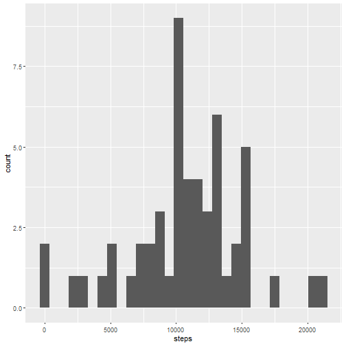
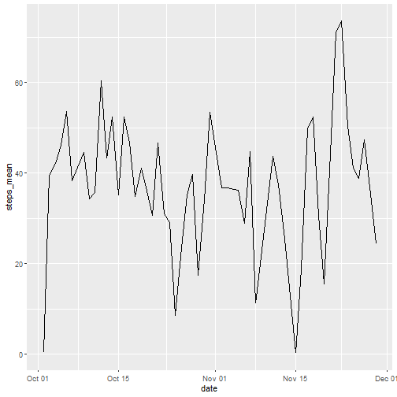
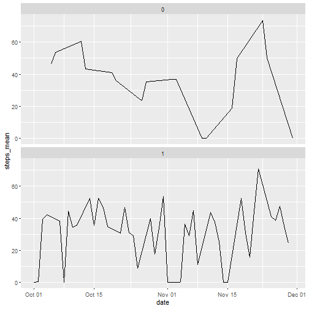

## PART 0: SETUP
echo settings for embedding code


Setting Directory

```r
getwd()
```

```
## [1] "C:/Dhruv/misc/data/R_5_Reproducible_Research/wk2_markdown_knitr"
```

```r
setwd("C:/Dhruv/misc/data/R_5_Reproducible_Research/wk2_markdown_knitr")
```

## PART I: PREPROCESSING DATA
Reading in step tracker csv:

```r
step_tracker <- read.csv("activity.csv")
```

Total daily steps:
(missing values ommitted)

```r
# loading up necessary packages

# install.packages("lubridate", repos='http://cran.us.r-project.org')
library(lubridate)
library(ggplot2)
library(knitr)

str(step_tracker)
```

```
## 'data.frame':	17568 obs. of  3 variables:
##  $ steps   : int  NA NA NA NA NA NA NA NA NA NA ...
##  $ date    : Factor w/ 61 levels "2012-10-01","2012-10-02",..: 1 1 1 1 1 1 1 1 1 1 ...
##  $ interval: int  0 5 10 15 20 25 30 35 40 45 ...
```

```r
# converting date format for easier calculations
step_tracker$date <- as.Date(step_tracker$date)

# aggregating daily steps
daily_aggregates <- na.omit(step_tracker)
str(daily_aggregates)
```

```
## 'data.frame':	15264 obs. of  3 variables:
##  $ steps   : int  0 0 0 0 0 0 0 0 0 0 ...
##  $ date    : Date, format: "2012-10-02" "2012-10-02" "2012-10-02" "2012-10-02" ...
##  $ interval: int  0 5 10 15 20 25 30 35 40 45 ...
##  - attr(*, "na.action")= 'omit' Named int  1 2 3 4 5 6 7 8 9 10 ...
##   ..- attr(*, "names")= chr  "1" "2" "3" "4" ...
```

```r
daily_aggregates <- aggregate(steps ~ date, daily_aggregates, FUN = sum)
```

Plotting histogram of daily steps taken:

```r
# plotting histogram of daily aggregates
daily_steps <- ggplot(daily_aggregates, aes(x = steps)) + geom_histogram()
daily_steps
```

```
## `stat_bin()` using `bins = 30`. Pick better value with `binwidth`.
```



Mean and median daily steps:

```r
# summarizing daily steps trends
summary(daily_aggregates$steps)
```

```
##    Min. 1st Qu.  Median    Mean 3rd Qu.    Max. 
##      41    8841   10765   10766   13294   21194
```
Min. 1st Qu.  Median    Mean 3rd Qu.    Max. 
 41    8841   10765   10766   13294   21194


Time series data processing:

```r
# tracking total step trends over time
time_series <- na.omit(step_tracker)

# preparing daily means
daily_averages <- na.omit(step_tracker)
daily_averages <- aggregate(steps ~ date, daily_averages, FUN = mean)

# renaming mean steps column
names(daily_averages)[2] <- "steps_mean"
```

Preparing data for plotting

```r
# creating time series data frame
time_series <- merge(time_series, daily_averages, by = 'date')

# producing time series plot
trend_lines <- ggplot(time_series, aes(x = date, y = steps_mean)) + geom_line()
trend_lines
```



Preparing data for identifying max mean interval

```r
# subsetting to rows having highest number of average daily steps
max <- time_series[time_series$steps_mean == max(time_series$steps_mean),]

# printing intervals with highest avg steps
max[max$steps == max(max$steps),]

# we find interval 1520 and 1530 have the highest average daily steps
```
            date steps interval steps_mean
13433 2012-11-23   760     1520   73.59028
13435 2012-11-23   760     1530   73.59028


## PART III: MISSING DATA & IMPUTATION

Summarizing missing data

```r
missing_values <- is.na(step_tracker$steps)
sum(missing_values)
```

```
## [1] 2304
```

```r
# % missing values:
sum(missing_values)/length(step_tracker$steps)
```

```
## [1] 0.1311475
```

```r
# 13 % of all steps values are missing

sum(!complete.cases(step_tracker))
```

```
## [1] 2304
```

```r
incomplete_cases <- step_tracker[!complete.cases(step_tracker),]

# 2304 rows out of 17568 cases contain missing values

# there are 8 days of missing data
```

Note: There are entire days of missing data for steps
This would mean imputing data from neighboring daily averages of steps

We can either impute the mean number of steps from the day preceding a day of 
missing data, or the day immediately following it.

However, since both the first and last day in our data have missing values for steps,
We'll have to reverse whichever strategy we pick for the final data point.


```r
unique_dates <- unique(step_tracker$date)

steps_impute <- merge(daily_averages, step_tracker, by = 'date', all = TRUE)

for (i in 1:61){
  for (j in 1:nrow(steps_impute)) {
    if(steps_impute$date[j] == unique_dates[i]){
      steps_impute$daynum[j] <- i
    }
  }
}

steps_impute$steps_mean[is.na(steps_impute$steps_mean)] <- 0

mean_vec <- aggregate(steps_mean~daynum, steps_impute, FUN = mean)


# replacing NA value with one before values
for (i in 300:nrow(steps_impute)){ # looping frmo 300 onwards to skip per 1 ie. day 1
  if (is.na(steps_impute$steps[i])){
    steps_impute$steps[i] <- mean_vec$steps_mean[mean_vec$daynum == steps_impute$daynum[i] - 1] 
  }
}

# replacing day 1 NAs with one step after values
for (i in 1:nrow(steps_impute)){
  if (is.na(steps_impute$steps[i])){
    steps_impute$steps[i] <- mean_vec$steps_mean[mean_vec$daynum == steps_impute$daynum[i] + 1] 
  }
}

# CREATING EQUAL DATASET WITH IMPUTED MISSING VALUES
step_tracker.imp <- steps_impute[c(3,1,4)]
```
      


Tabulating values from our new dataset to fill in missing values
And produce more intelligible trends

```r
hist(step_tracker.imp$steps, # histogram
 col = "peachpuff", # column color
 border = "black", 
# prob = TRUE, # show densities instead of frequencies
# xlim = c(0,200),
 # ylim = c(0,3),
 xlab = "Daily Steps",
 main = "Step Tracker")
# lines(density(step_tracker.imp$steps), # density plot
#  lwd = 2, # thickness of line
#  col = "chocolate3")
# Next we'll add a line for the mean:

abline(v = mean(step_tracker.imp$steps),
 col = "royalblue",
 lwd = 2)
# And a line for the median:

abline(v = median(step_tracker.imp$steps),
 col = "red",
 lwd = 2)
```


```r
mean_daily_steps <- aggregate(steps ~ date, step_tracker.imp, FUN = mean)

avg_daily_steps <- ggplot(mean_daily_steps, aes(x = steps)) + geom_histogram()
avg_daily_steps
```

```
## `stat_bin()` using `bins = 30`. Pick better value with `binwidth`.
```


```r
# mean distribution looks almost identical
# values on the x axis differ slightly


med_daily_steps <- aggregate(steps ~ date, step_tracker.imp, FUN = median)

median_daily_steps <- ggplot(med_daily_steps, aes(x = steps)) + geom_histogram()
median_daily_steps
```

```
## `stat_bin()` using `bins = 30`. Pick better value with `binwidth`.
```


```r
# imputing increases the total number of daily steps
```

## PART IV: FACTORIZED PANELS


```r
# remember in lubridate, day(), day 1 = monday, day 7 = sunday

steps_impute$day <- wday(steps_impute$date)

# creating factored variable
steps_impute$weekday <- ifelse(steps_impute$day <= 5, 1, 0)
steps_impute$weekday <- as.factor(steps_impute$weekday)

# producing weekday vs weekend plot

trend_lines_wday <- ggplot(steps_impute, aes(x = date, y = steps_mean)) + geom_line() +
                        facet_wrap(~weekday, ncol = 1)
trend_lines_wday
```




## PART V: CONCLUSION

```r
#knitting results  

# install.packages("markdown", repos='http://cran.us.r-project.org')
# install.packages("rmarkdown", repos='http://cran.us.r-project.org')

library(markdown)
library(rmarkdown)


knit("C:/Dhruv/misc/data/R_5_Reproducible_Research/wk2_markdown_knitr/PA1_template.Rmd",output="C:/Dhruv/misc/data/R_5_Reproducible_Research/wk2_markdown_knitr/PA1_template.html files.html")
```

```
## 
## 
## processing file: C:/Dhruv/misc/data/R_5_Reproducible_Research/wk2_markdown_knitr/PA1_template.Rmd
```

```
## Error in parse_block(g[-1], g[1], params.src): duplicate label 'setup'
```

```r
knit("C:/Dhruv/misc/data/R_5_Reproducible_Research/wk2_markdown_knitr/PA1_template.Rmd",output="C:/Dhruv/misc/data/R_5_Reproducible_Research/wk2_markdown_knitr/PA1_template.html files.md")
```

```
## 
## 
## processing file: C:/Dhruv/misc/data/R_5_Reproducible_Research/wk2_markdown_knitr/PA1_template.Rmd
```

```
## Error in parse_block(g[-1], g[1], params.src): duplicate label 'setup'
```


