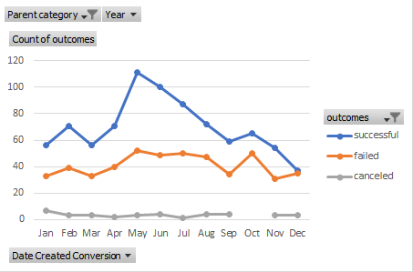
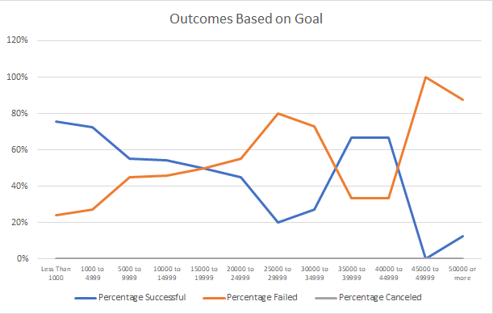

# Kickstarting with Excel

## Overview of Project

The purpose of this project was to discover relationships between funding and outcomes. 

### Purpose

## Analysis and Challenges

### Analysis of Outcomes Based on Launch Date

<<<<<<< HEAD
Insert Image

### Analysis of Outcomes Based on Goals

Insert Image
=======

### Analysis of Outcomes Based on Goals

>>>>>>> a37027ff47aa8514428b0d6bbc48b059c297ef8a

### Challenges and Difficulties Encountered

No challenges as such.

## Results

- What are two conclusions you can draw about the Outcomes based on Launch Date?

Successful outcomes peak in May. Converge in December.

- What can you conclude about the Outcomes based on Goals?

Percentage Successful and Percentage Failed are countercyclical.

- What are some limitations of this dataset?

It's restricted to certain time period. At other times, macroeconomic conditions might be different, 

and thus affect the sorts of projects attracting funding.

- What are some other possible tables and/or graphs that we could create?

Maybe a heatmap, or correlation between funding and outcomes.

